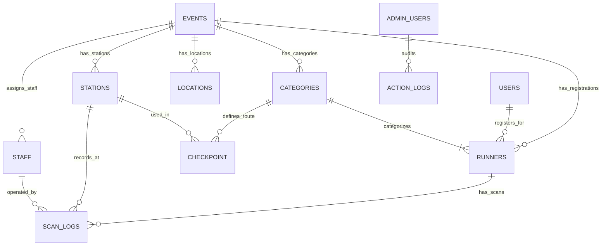

# Daily Summary & Architecture Reference Handoff: Database Flow, Sync Modes, and Runner Data Alignment

**Date:** 2026-09-11  
**Project:** Trail Running Hub (`Rohn-Admin` & `Rohn-Runner`)  
**Author:** AI Pair Programmer (Antigravity) & User  
**Status:** All tasks tested (94/94 tests passing), production build verified, ready for GitHub push  

---

## 1. Executive Summary of Completed Work

During today's sessions, multiple key enhancements, data standardizations, and network controls were implemented across the timing and admin management systems:

### 1.1 GitHub Integration & Codebase Merging
- Merged and reconciled upstream PRs (`dev-gong` into `main`) across both `Rohn-Admin` (PR #11) and `Rohn-Runner` (PR #8).
- Verified environment parity, dependencies, and automated test runners.

### 1.2 Manual Runner Registration Enhancements (`ImportRunners.jsx`)
- **Database-Backed Dropdowns:** Completely replaced manual free-text inputs for manual entry with live database references filtered by the selected `event_id`:
  - **Category / Distance:** Automatically aggregates categories from the `categories` table and existing `runners` records.
  - **Age Groups & Ages:** Dynamically extracted from registered runners and sorted naturally.
  - **Nationalities:** Curated default list (`THAI`, `JPN`, `CHN`, `USA`, etc.) plus custom input capability.
  - **Gender Normalization:** Strictly standardized to English only (`Male` / `Female`), eliminating ambiguous abbreviations (`M`/`F`) and Thai characters (`ชาย`/`หญิง`) from database insertions.
- **Auto Next-BIB Suggester:** Added an interactive "⚡ แนะนำ BIB ถัดไป (Auto)" button that analyzes the active database to calculate the highest numeric BIB and recommends the next sequential number.
- **Real-Time BIB Collision Detection:** Live duplicate BIB checker that alerts operators immediately if an entered BIB already exists in the system.

### 1.3 Runners List & Modal Data Synchronization (`RunnersList.jsx` & `EditRunnerModal.jsx`)
- **Age Group Column:** Updated table column header and data mapping in `RunnersList.jsx` from "Age" to "Age Group", displaying `runner.age_group || runner.age`.
- **Edit Modal Database References:** Upgraded `EditRunnerModal.jsx` to adopt the same database-backed dropdown selection as `ImportRunners.jsx`.
- **Duplicate BIB Guard:** Added collision detection in `EditRunnerModal` ensuring edited BIBs do not collide with any other runner in the same event.
- **`safeFetch` Hardening:** Fixed a silent fetch rejection in `supabaseClient.js` where cloning request headers with non-enumerable properties caused update calls to fail.

### 1.4 Standardization of Category Columns (`cat`, `cat_name`, `distance`, `unit`)
Identified and fixed an issue where `cat_name` was previously saved as `null` or raw strings without distance prefixes:
- **`cat` (Composite String):** Formatted strictly as `[distance] KM : [cat_name]` (e.g., `5 KM : Soft Rock`, `10 KM : Hard Rock`), maintaining 100% parity with Excel import data.
- **`cat_name` (Clean Category String):** Stores only the clean category name (e.g., `Soft Rock`, `Hard Rock`).
- **`distance` (Float):** Stores the numeric distance (e.g., `5`, `10`).
- **`unit` (Uppercase String):** Standardized to uppercase `'KM'`.
- Applied uniformly across Excel imports, manual registration, and the runner edit modal.

### 1.5 Manual Network Mode Toggle (`NetworkModeToggle.jsx`)
Introduced a user-controlled Network Mode Switcher on all timing scanning stations (`CheckIn.jsx`, `CheckPoint.jsx`, `FinishLine.jsx`):
- **Location:** Placed prominently directly adjacent to the **"ตั้งค่า" (Setup)** button in the top action bar.
- **Modes:**
  - **Auto (Online Mode):** Functions as standard automatic online mode. Scans are immediately pushed to Supabase in the background; if connection drops, scans are safely queued locally.
  - **ออฟไลน์ (Forced Offline Mode):** Completely suppresses outbound network calls. All scans are recorded strictly to local state, IndexedDB, and `trail_pending_sync_queue`.
- **One-Click Re-sync:** Switching back to **Auto** instantly wakes the background queue processor to upload all queued scans in FIFO order without data loss.

---

## 2. Current Blockers, Pending Tasks & Watch Items

| Priority | Item | Description | Recommended Solution |
|---|---|---|---|
| **Medium** | **Legacy Data Cleanup in Supabase** | Historical runner rows imported before this fix may have `cat_name: null` or `cat` without the distance prefix (`Soft Rock` instead of `5 KM : Soft Rock`). | Run a one-time SQL script or utilize the Admin Batch Rebuild script to backfill `cat_name` and prepend distance. |
| **Low** | **Table Name Discrepancies in Legacy Migrations** | Historical migration scripts in `supabase/migrations/` occasionally refer to `checkpoints` (plural) whereas the active schema uses `checkpoint` (singular). | Keep referencing `checkpoint` as documented in `DatabaseFlow.jsx`. |
| **Watch** | **Offline Multi-Device Sync Concurrency** | When multiple timing devices go offline and later reconnect simultaneously, bulk sync could encounter high Supabase RPC concurrency. | Existing exponential backoff and `pushScanViaRpc` self-healing in `RaceContext.jsx` manage this, but monitor Supabase logs during high-volume races. |

---

## 3. Data Source Architecture & Mapping (Referencing `DatabaseFlow.jsx`)

The system follows a multi-event relational model documented in `DatabaseFlow.jsx`. Below is the authoritative data source mapping:

### 3.1 Core Entity Relationships

### 3.2 Data Source Mapping Table

| UI Field / Requirement | Primary Table & Column | Fallback / Reference Column | Description & Usage |
|---|---|---|---|
| **Event Filter** | `events.id` | `events.name`, `events.status` | Scopes all data queries (`runners`, `categories`, `stations`). |
| **Category Name (Clean)** | `runners.cat_name` | `categories.name` | The clean category title (e.g. `Soft Rock`, `Hard Rock`). |
| **Full Category String** | `runners.cat` | `${distance} KM : ${cat_name}` | The composite format used across public display & leaderboards. |
| **Distance & Unit** | `runners.distance`, `runners.unit` | `categories.distance_km`, `categories.unit` | Numeric distance (e.g. `5`, `10`) and uppercase unit (`KM`). |
| **Category Color** | `categories.color` | `catColorMap[cat_name]` | Hex color used for category badges and monitor cards. |
| **BIB Number** | `runners.bib` | Generated via Max(BIB)+1 | Unique identifier per `event_id`. |
| **Gender** | `runners.gender` | `users.gender` | Standardized to `'Male'` or `'Female'`. |
| **Age Group** | `runners.age_group` | `runners.age` | Age category bracket (e.g. `20-29`, `30-39`, `Overall`). |
| **Station Type** | `stations.type` | `START`, `CP`, `FINISH` | Identifies timing station behavior. |
| **Checkpoint Cutoff** | `checkpoint.cutoff_time` | `checkpoint.sequence_order` | Category-specific route sequence and cutoffs. |
| **Scan Timestamps** | `scan_logs.scan_time` | `runners.checked_in_at`, etc. | Authoritative server timing log recorded via RPC. |

---

## 4. Verification & Testing Summary

1. **Vitest Unit Tests:**
   - Ran `npm test` in `Rohn-Admin`.
   - **Result:** 94/94 passing across 5 test suites (`bibUtils`, `roles`, `supabaseResult`, `supabaseFetch`, `scanSync`).
2. **Production Build:**
   - Ran `npm run build` in `Rohn-Admin`.
   - **Result:** Vite build passed in 3.13s without syntax, bundling, or chunk errors.
3. **Git Cleanliness:**
   - All modified files reviewed, staged, and prepared for commit.
