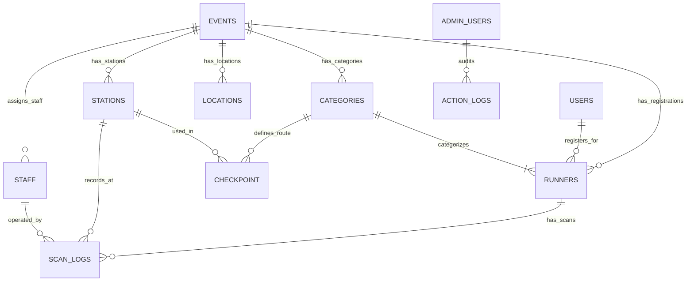

# System Integration & Technical Handoff: Realtime Monitor Broadcast, Category Colors, Auto-Routing, and Database Architecture

**Date:** 2026-09-12  
**Projects:** `Rohn-Admin` (Mae_khanin_Admin) & `Rohn-Runner` (ROHN-RUNNER)  
**Author:** AI Pair Programmer (Antigravity) & Lead Engineer  
**Status:** Tested & Verified (Vitest 94/94 passing in Admin, 9/9 passing in Runner; production builds verified)  

---

## 1. Executive Summary of All Completed Work

### 1.1 Dual-Repo GitHub Pull & Merge with Local-First Precedence
- **Branch Synchronization:** Merged remote PR updates (`dev-gong`) into `main` for both repositories:
  - `Rohn-Admin`: Merged PR #12 (`ccf864f`), incorporating cross-device Finish Line casting and category color migrations while fully preserving local network mode toggles and data formatters.
  - `Rohn-Runner`: Merged PR #9 (`8936935`), bringing category color glow and Finish Line rank computation while preserving the responsive monitor layout and resizable ratio controls.
- **Safety Backup:** Before merging, both repositories were synchronized and backed up to the remote branch **`Tiw-dev`**.

### 1.2 Finish Line to Monitor Realtime Broadcast (`FinishLine.jsx`)
- **Multi-Device / Cross-Origin Broadcasting:** Upgraded `FinishLine.jsx` from local-only BroadcastChannel to a dual-layer transport:
  - **Layer 1 (Supabase Realtime Broadcast):** Sends payload over `rohn_monitor_stream` and `results:${selectedEventId}`, allowing the Finish Line scanner laptop to cast directly to smart TVs, projector laptops, and remote screens across different networks.
  - **Layer 2 (BroadcastChannel & LocalStorage):** Retains instant zero-latency same-browser window-to-window fallback.
- **Live Finish Data Payload:** Transmits `bib`, `name`, `distance`, `ageGroup`, `finishTime` (net time), and `finishAt` timestamp.

### 1.3 Monitor Finish Mode, Live Ranking, Layout Optimization & Animation Re-Keying (`Monitor.jsx`)
- **Status Badge Differentiation:**
  - `Start`: Displays gun start time / scheduled wave start.
  - `Check in`: Displays check-in timestamp.
  - `Finish`: Displays official net finish time.
- **Live Leaderboard Ranking:** When a finish scan is received, `Monitor.jsx` computes and renders the runner's live standing:
  - `อันดับรุ่น #[catRank] • อันดับรวม #[overallRank]`
- **Vertical Stacked Metadata Hierarchy & Gender Display:**
  - Replaced the horizontal wrapped row with a vertical column (`flexDirection: 'column'`, `gap: 8px`).
  - **Category Pill:** Enlarged font size to `clamp(1.8rem, 3.2vw, 3.8rem)` displaying `${distance} : ${cat_name}` with dynamic category background color.
  - **Gender Normalization & Display:** Added dedicated gender text (`Male` / `Female` via `isMale`/`isFemale` parsing) in `clamp(1.8rem, 3.2vw, 3.8rem)` font size and `600` weight.
  - **Age Group Badge:** Enlarged to `clamp(1.8rem, 3.2vw, 3.8rem)` for clear legibility on large stadium and projector screens.
- **Right Column Layout & Settings Clearance:** Added `paddingTop: '5rem'` to the right side display and structured the map/logo section with flex column alignment (`alignSelf: 'center'`). This eliminates visual overlap with the floating Settings/Controls toggle button at the top-right corner.
- **Visual & Logo Calibration:** Numbers glow with the runner's specific category color (`catColor`), and sponsor/event logos (`Baan Pong`, `Mae Khaning`, `ROHN`) have been upscaled to `clamp(55px, 6vw, 90px)` and `clamp(65px, 7.5vw, 110px)` (responsive rule: `height: 60px !important`), arranged with `justify-content: space-around` and `marginTop: '1rem'` for prominent presentation.
- **Guaranteed Entrance Animation & Re-render (`displayData.timestamp`):** Re-keyed the active runner display container from `castEvent?.timestamp` to `displayData.timestamp`. This ensures that every check-in or finish scan—including manual BIB entry and local events—reliably re-triggers the entrance CSS animation and progress timers without getting stuck or skipped.

### 1.4 Scanner Auto-Routing by Distance (`Scanner.jsx` & `ScannerInput.jsx`)
- **Automated Screen Directing:** Operators scanning at multi-distance events can now route runners to designated monitors automatically based on distance (e.g., `10KM` -> Monitor 1, `5KM` -> Monitor 2).
- **Interactive Configuration:** Operators can toggle Auto-Route on/off and configure custom distance mapping rules with `localStorage` persistence (`rohn_routing_rules`, `rohn_auto_route_enabled`).
- **Target Monitor Sync:** Ensures that when Auto-Route is active, the success message and cast event payload both accurately target the dynamically routed monitor ID.

### 1.5 Category Data Format Standardization & Database-Backed Entry
- **Category Data Format:**
  - `cat`: Formatted strictly as `[distance] KM : [cat_name]` (e.g., `5 KM : Soft Rock`, `10 KM : Hard Rock`).
  - `cat_name`: Clean category string (e.g., `Soft Rock`, `Hard Rock`) — eliminating legacy `null` values.
  - `distance`: Floating-point numeric (e.g., `5`, `10`).
  - `unit`: Uppercase `'KM'`.
- **Database-Driven Forms:** `ImportRunners.jsx` and `EditRunnerModal.jsx` query active database reference data dynamically:
  - Dropdown lists for categories, age groups, and nationalities.
  - Strict English gender normalization (`Male` / `Female`).
  - Real-time duplicate BIB collision warning and auto next-BIB suggestion.

### 1.6 Station Network Mode Switcher (`NetworkModeToggle.jsx`)
- **User-Controlled Connectivity:** A toggle button placed beside "ตั้งค่า" (Settings) on `CheckIn.jsx`, `CheckPoint.jsx`, and `FinishLine.jsx`.
- **Auto Mode:** Automatically synchronizes scans to Supabase in the background when connected; safely queues scans if offline.
- **Offline Mode:** Suppresses outbound network requests; writes strictly to local IndexedDB and `trail_pending_sync_queue`. Flushes queued scans automatically once switched back to Auto.

### 1.7 Thermal E-Slip Print Calibration for 14cm Paper (`ESlip.jsx` & `ESlip.css`)
- **Target Paper Specifications:** 80mm roll width with exact 14 cm (140 mm) cut/sheet length.
- **Root Cause of Previous Print Issue:**
  - `@page { size: auto; }` allowed browser print engines to use unpredictable driver defaults (e.g. 297mm receipt height).
  - Print CSS had aggressively shrunk logo heights (to 28–40px) and row paddings (to 1px), yielding a total height of only **11.35 cm**, leaving an empty ~2.65 cm blank gap at the bottom before the 14 cm paper cut edge.
- **Exact Dimension Locking:**
  - **Paged Media Size:** Declared `@page { size: 80mm 140mm; margin: 0mm; }` to lock Chrome, Edge, and thermal printer drivers directly to the 80mm x 140mm paper dimension.
  - **Boundary Enclosure:** `html, body` set to `width: 80mm !important; height: 140mm !important; max-height: 140mm !important; overflow: hidden !important;` to eliminate any chance of accidental 2nd page creation.
  - **Portal Centering:** `.modal-bg.eslip-modal-portal` and child wrapper set to `height: 140mm !important;` with flex centering.
  - **Slip Container (`138mm`):** `.eslip` locked to `height: 138mm !important; max-height: 138mm !important; min-height: 138mm !important;` leaving a 1mm top and bottom safety buffer. This prevents the printer cutter from clipping the border and guarantees single-sheet execution.
- **Dynamic Content Distribution (`.eslip-body`):**
  - Grouped all middle elements (5 runner info rows, station splits, and 2 stat grids) inside `
`.
  - Configured with `display: flex !important; flex-direction: column !important; justify-content: space-evenly !important; flex: 1 1 auto !important; min-height: 0 !important;`.
  - **Top Anchor:** `.head` stays pinned to the top of the 14cm paper with Baan Pong Trail logo (`height: 44px !important;`) and "Official e-Slip" title.
  - **Bottom Anchor:** `.foot` stays pinned to the bottom with Mae Khaning (`28px`), ROHN Full (`38px`), Timing System by ROHN (`18px`), and provisional result note.
  - **Adaptive Spacing:** Regardless of whether a runner has 0, 2, or 5 checkpoints, the 33mm flex space distributes evenly across rows and stat boxes, completely filling the 14cm paper without dead space.
- **Thermal Print Contrast Optimization:** High contrast black `#000000` text with bold values and `#334155` labels for crisp rendering on thermal print heads.

---

## 2. Current Blockers, Pending Tasks & Watch Items

| Item | Impact | Context & Root Cause | Actionable Solution |
|---|---|---|---|
| **1. Legacy Data Cleanup in Supabase** | Medium | Older runner records created before standardizing `cat_name` still contain `null` in `runners.cat_name` or lack distance prefix in `runners.cat`. | Execute a SQL backfill query in the Supabase SQL editor using regex extraction, or run the Admin Data Rebuild tool. |
| **2. Table Name Singular/Plural Discrepancy** | Low | Older migrations in `supabase/migrations/` refer to `checkpoints` (plural), whereas the production schema in `DatabaseFlow.jsx` defines `checkpoint` (singular). | Ensure all frontend queries and future migrations consistently query `checkpoint` as documented in `DatabaseFlow.jsx`. |
| **3. Concurrent Multi-Device Sync on Reconnect** | Watch | If several field stations stay offline for hours and rejoin Wi-Fi simultaneously, batch RPC traffic could spike. | Handled via exponential backoff (up to 30s) and dead-letter parking in `RaceContext.jsx`, but verify Supabase connection limits during 1,000+ runner events. |

---

## 3. Authoritative Data Source Mapping (Based on `DatabaseFlow.jsx`)

Below is the architectural map derived from `DatabaseFlow.jsx` defining which tables and fields provide data for each operational requirement:

### 3.1 Architecture Diagram

### 3.2 Field-by-Field Reference Guide

| Data Requirement | Primary Table & Column | Fallback / Reference Source | Intended Usage & Handling |
|---|---|---|---|
| **Active Event Scope** | `events.id` | `events.name`, `events.status` | Primary key that scopes all runners, categories, stations, and logs. Changing event re-fetches all reference caches. |
| **Category Title (Clean)** | `runners.cat_name` | `categories.name` | The pure category identifier without distance prefixes (e.g. `Soft Rock`, `Hard Rock`). |
| **Full Category String** | `runners.cat` | `${distance} KM : ${cat_name}` | Formatted composite string used for public leaderboard headers and registration tags. |
| **Distance & Unit** | `runners.distance`, `runners.unit` | `categories.distance_km`, `categories.unit` | Numeric float (`5`, `10`) and uppercase string (`'KM'`). Used for pace calculations and routing rules. |
| **Category Theme Color** | `categories.color` | `catColorMap[cat_name]` | Hex color code (e.g., `#FF5733`) for monitor glow, BIB numbers, and category badge styling. |
| **Runner Identification** | `runners.bib` | Auto-generated Max(BIB)+1 | Unique BIB string per `event_id`. Must not collide within the same event. |
| **Gender** | `runners.gender` | `users.gender` | Standardized to English `'Male'` or `'Female'`. |
| **Age & Age Group** | `runners.age_group` | `runners.age` | Bracket identifier (e.g., `20-29`, `30-39`, `Overall`) used for leaderboard ranking. |
| **Check-in Timestamp** | `runners.checked_in_at` | `runners.checkin` (epoch) | Time runner received their packet/RFID tag. |
| **Timing Stations & Cutoffs** | `stations.type`, `checkpoint.cutoff_time` | `checkpoint.sequence_order` | Configures whether station acts as START, CP, or FINISH, and establishes route cutoffs per category. |
| **Timing Logs (Immutable)** | `scan_logs.scan_time` | `scan_logs.scanned_by` | Authoritative timestamp and operator attribution stored in database via RPC. |

---

## 4. Verification & Testing

1. **Vitest Test Suite (`Rohn-Admin`):**
   - 94 passed (100% success rate across 5 test suites).
2. **Node Test Suite (`Rohn-Runner`):**
   - 9 passed (100% success rate on `results.test.js`).
3. **Production Builds:**
   - `Rohn-Admin`: Vite build completed in 12.57s without errors.
   - `Rohn-Runner`: Vite build completed in 893ms without errors.
4. **Git Remote Synchronization:**
   - Both `main` and `Tiw-dev` branches verified, merged, and pushed to GitHub.

---

## 5. E-Slip 15cm Paper Length & High-Contrast Thermal Monochrome Calibration

### 5.1 Issue & Root Cause
1. **Paper Length Measurement & Empty Void:**
   - Previous compacting left excessive empty blank space below the content when previewing/printing on thermal roll paper, which measured up to 24cm due to driver default spooling without strict 15cm constraints.
   - User requirement: produce a receipt with an exact length of ~15 cm (150mm), filling the slip proportionately without empty voids.
2. **Faint/Dithered Colors on Thermal Print:**
   - Thermal heads cannot reproduce color or gray halftones. Slate hex colors (`#334155`, `#64748b`), category colors, blue net time, and color logos (`logoBaanPong`, `logoMaekhaning`, `logoRohn`) were dithered into faint sparse dot matrices, resulting in washed-out prints.

### 5.2 Solution Implemented
1. **Calibrated 15cm Paper Dimensions & Even Spacing:**
   - In `@media print`:
     - `@page { size: 80mm 150mm; margin: 0mm; }`
     - `html, body`: strictly locked to `width: 80mm; height: 150mm; max-height: 150mm; overflow: hidden;`
     - `.modal-bg.eslip-modal-portal > div`: `height: 147mm;`
     - `.eslip`: `height: 147mm; max-height: 147mm; display: flex; flex-direction: column; justify-content: space-between;`
     - `.eslip-body`: `display: flex; flex-direction: column; justify-content: space-evenly; flex: 1 1 auto;`
     - Proportioned header logo (`42px`), footer logos (`26px/36px`), and stat boxes (`padding: 3.5px 3px`) so the receipt content evenly and comfortably fills the entire 15cm page without empty white voids.
    - Applied `filter: grayscale(100%) brightness(115%) contrast(140%) !important;` and `mix-blend-mode: multiply !important;` to all logos, eliminating off-white/gray bounding box artifacts and ensuring the background remains 100% pure snow-white while keeping artwork and text deep black.
    - Category color dot hidden in print (`.eslip-cat-dot { display: none !important; }`).
    - Stat boxes render with white background and solid black borders `1.2px solid #000000 !important`.
    - Synchronized across both `Rohn-Admin` and `Rohn-Runner`.
