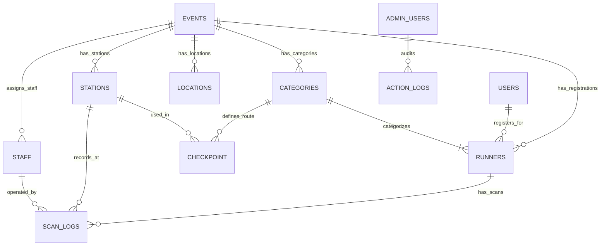

# System Integration & Technical Handoff: Realtime Monitor Broadcast, Category Colors, Auto-Routing, and Database Architecture

**Date:** 2026-09-12  
**Projects:** `Rohn-Admin` (Mae_khanin_Admin) & `Rohn-Runner` (ROHN-RUNNER)  
**Author:** AI Pair Programmer (Antigravity) & Lead Engineer  
**Status:** Tested & Verified (Vitest 94/94 passing in Admin, 9/9 passing in Runner; production builds verified)  

---

## 1. Executive Summary of All Completed Work

### 1.1 Dual-Repo GitHub Pull & Merge with Local-First Precedence
- **Branch Synchronization:** Merged remote PR updates (`dev-gong`) into `main` for both repositories:
  - `Rohn-Admin`: Merged PR #12 (`ccf864f`), incorporating cross-device Finish Line casting and category color migrations while fully preserving local network mode toggles and data formatters.
  - `Rohn-Runner`: Merged PR #9 (`8936935`), bringing category color glow and Finish Line rank computation while preserving the responsive monitor layout and resizable ratio controls.
- **Safety Backup:** Before merging, both repositories were synchronized and backed up to the remote branch **`Tiw-dev`**.

### 1.2 Finish Line to Monitor Realtime Broadcast (`FinishLine.jsx`)
- **Multi-Device / Cross-Origin Broadcasting:** Upgraded `FinishLine.jsx` from local-only BroadcastChannel to a dual-layer transport:
  - **Layer 1 (Supabase Realtime Broadcast):** Sends payload over `rohn_monitor_stream` and `results:${selectedEventId}`, allowing the Finish Line scanner laptop to cast directly to smart TVs, projector laptops, and remote screens across different networks.
  - **Layer 2 (BroadcastChannel & LocalStorage):** Retains instant zero-latency same-browser window-to-window fallback.
- **Live Finish Data Payload:** Transmits `bib`, `name`, `distance`, `ageGroup`, `finishTime` (net time), and `finishAt` timestamp.

### 1.3 Monitor Finish Mode & Live Ranking (`Monitor.jsx`)
- **Status Badge Differentiation:**
  - `Start`: Displays gun start time / scheduled wave start.
  - `Check in`: Displays check-in timestamp.
  - `Finish`: Displays official net finish time.
- **Live Leaderboard Ranking:** When a finish scan is received, `Monitor.jsx` computes and renders the runner's live standing:
  - `อันดับรุ่น #[catRank] • อันดับรวม #[overallRank]`
- **Visual Enhancements:** Numbers glow with the runner's specific category color (`catColor`), and sponsor/event logos (`Baan Pong`, `Mae Khaning`, `ROHN`) have been calibrated for large-screen visibility (`clamp(45px, 5vw, 75px)`).

### 1.4 Scanner Auto-Routing by Distance (`Scanner.jsx` & `ScannerInput.jsx`)
- **Automated Screen Directing:** Operators scanning at multi-distance events can now route runners to designated monitors automatically based on distance (e.g., `10KM` -> Monitor 1, `5KM` -> Monitor 2).
- **Interactive Configuration:** Operators can toggle Auto-Route on/off and configure custom distance mapping rules with `localStorage` persistence (`rohn_routing_rules`, `rohn_auto_route_enabled`).

### 1.5 Category Data Format Standardization & Database-Backed Entry
- **Category Data Format:**
  - `cat`: Formatted strictly as `[distance] KM : [cat_name]` (e.g., `5 KM : Soft Rock`, `10 KM : Hard Rock`).
  - `cat_name`: Clean category string (e.g., `Soft Rock`, `Hard Rock`) — eliminating legacy `null` values.
  - `distance`: Floating-point numeric (e.g., `5`, `10`).
  - `unit`: Uppercase `'KM'`.
- **Database-Driven Forms:** `ImportRunners.jsx` and `EditRunnerModal.jsx` query active database reference data dynamically:
  - Dropdown lists for categories, age groups, and nationalities.
  - Strict English gender normalization (`Male` / `Female`).
  - Real-time duplicate BIB collision warning and auto next-BIB suggestion.

### 1.6 Station Network Mode Switcher (`NetworkModeToggle.jsx`)
- **User-Controlled Connectivity:** A toggle button placed beside "ตั้งค่า" (Settings) on `CheckIn.jsx`, `CheckPoint.jsx`, and `FinishLine.jsx`.
- **Auto Mode:** Automatically synchronizes scans to Supabase in the background when connected; safely queues scans if offline.
- **Offline Mode:** Suppresses outbound network requests; writes strictly to local IndexedDB and `trail_pending_sync_queue`. Flushes queued scans automatically once switched back to Auto.

---

## 2. Current Blockers, Pending Tasks & Watch Items

| Item | Impact | Context & Root Cause | Actionable Solution |
|---|---|---|---|
| **1. Legacy Data Cleanup in Supabase** | Medium | Older runner records created before standardizing `cat_name` still contain `null` in `runners.cat_name` or lack distance prefix in `runners.cat`. | Execute a SQL backfill query in the Supabase SQL editor using regex extraction, or run the Admin Data Rebuild tool. |
| **2. Table Name Singular/Plural Discrepancy** | Low | Older migrations in `supabase/migrations/` refer to `checkpoints` (plural), whereas the production schema in `DatabaseFlow.jsx` defines `checkpoint` (singular). | Ensure all frontend queries and future migrations consistently query `checkpoint` as documented in `DatabaseFlow.jsx`. |
| **3. Concurrent Multi-Device Sync on Reconnect** | Watch | If several field stations stay offline for hours and rejoin Wi-Fi simultaneously, batch RPC traffic could spike. | Handled via exponential backoff (up to 30s) and dead-letter parking in `RaceContext.jsx`, but verify Supabase connection limits during 1,000+ runner events. |

---

## 3. Authoritative Data Source Mapping (Based on `DatabaseFlow.jsx`)

Below is the architectural map derived from `DatabaseFlow.jsx` defining which tables and fields provide data for each operational requirement:

### 3.1 Architecture Diagram

### 3.2 Field-by-Field Reference Guide

| Data Requirement | Primary Table & Column | Fallback / Reference Source | Intended Usage & Handling |
|---|---|---|---|
| **Active Event Scope** | `events.id` | `events.name`, `events.status` | Primary key that scopes all runners, categories, stations, and logs. Changing event re-fetches all reference caches. |
| **Category Title (Clean)** | `runners.cat_name` | `categories.name` | The pure category identifier without distance prefixes (e.g. `Soft Rock`, `Hard Rock`). |
| **Full Category String** | `runners.cat` | `${distance} KM : ${cat_name}` | Formatted composite string used for public leaderboard headers and registration tags. |
| **Distance & Unit** | `runners.distance`, `runners.unit` | `categories.distance_km`, `categories.unit` | Numeric float (`5`, `10`) and uppercase string (`'KM'`). Used for pace calculations and routing rules. |
| **Category Theme Color** | `categories.color` | `catColorMap[cat_name]` | Hex color code (e.g., `#FF5733`) for monitor glow, BIB numbers, and category badge styling. |
| **Runner Identification** | `runners.bib` | Auto-generated Max(BIB)+1 | Unique BIB string per `event_id`. Must not collide within the same event. |
| **Gender** | `runners.gender` | `users.gender` | Standardized to English `'Male'` or `'Female'`. |
| **Age & Age Group** | `runners.age_group` | `runners.age` | Bracket identifier (e.g., `20-29`, `30-39`, `Overall`) used for leaderboard ranking. |
| **Check-in Timestamp** | `runners.checked_in_at` | `runners.checkin` (epoch) | Time runner received their packet/RFID tag. |
| **Timing Stations & Cutoffs** | `stations.type`, `checkpoint.cutoff_time` | `checkpoint.sequence_order` | Configures whether station acts as START, CP, or FINISH, and establishes route cutoffs per category. |
| **Timing Logs (Immutable)** | `scan_logs.scan_time` | `scan_logs.scanned_by` | Authoritative timestamp and operator attribution stored in database via RPC. |

---

## 4. Verification & Testing

1. **Vitest Test Suite (`Rohn-Admin`):**
   - 94 passed (100% success rate across 5 test suites).
2. **Node Test Suite (`Rohn-Runner`):**
   - 9 passed (100% success rate on `results.test.js`).
3. **Production Builds:**
   - `Rohn-Admin`: Vite build completed in 12.57s without errors.
   - `Rohn-Runner`: Vite build completed in 893ms without errors.
4. **Git Remote Synchronization:**
   - Both `main` and `Tiw-dev` branches verified, merged, and pushed to GitHub.
